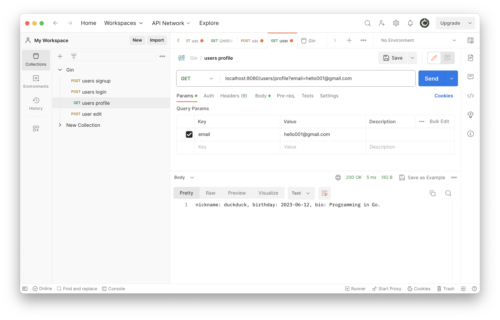

# webook

A simple web application back-end writing in Go. Using MySQL as the database.

Now supports:
+ Sign up new user.
+ Log in existing user.
+ Edit user's profile.
+ Query user's profile.

A lot of new features on the way...

---

### week2 homework:
Get the query parameter from url and display the user's profile:

